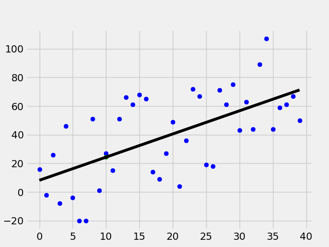

# Overview
In this project, the Linear Regression Algorithm was built from scratch.

First, a dataset is randomly generated. Then the best fit slope and intercept for the dataset is determined. The Squared Error and Coefficient of Determination is also calculated to gauge the performance of the mode.

This is a visualization of the line of best fit the algorithm determined for a randomly generated dataset:

# Dependencies
* Numpy
* Matplotlib

# Usage
1. `cd '..\Linear Regression Algorithm from Scratch' `
1. `python 'Linear Regression Algorithm From Scratch.py'`

# Credit
[Sentdex](https://www.youtube.com/channel/UCfzlCWGWYyIQ0aLC5w48gBQ)
